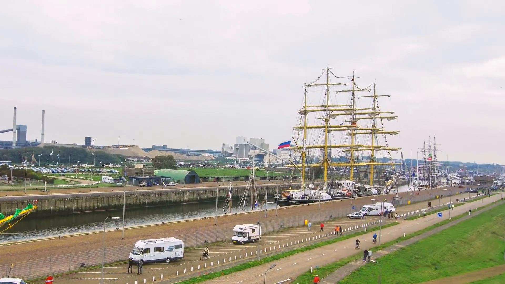
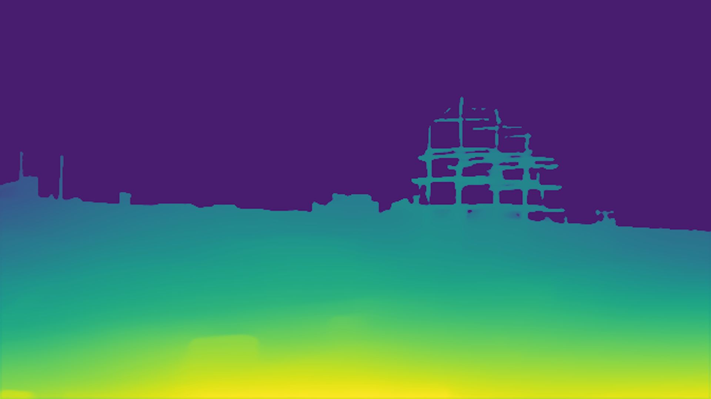
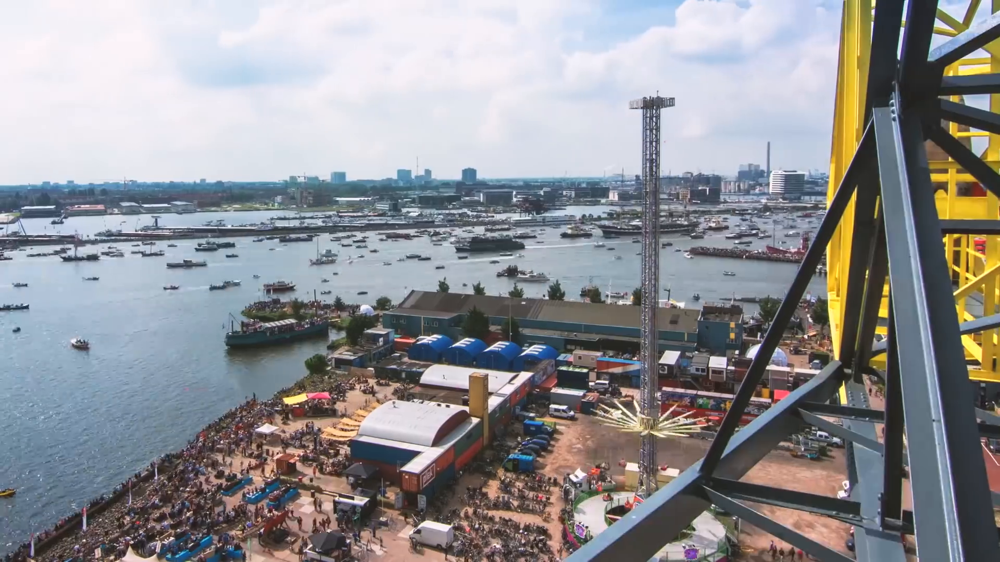

# Hazy images generator
## Dataset
We made a large dataset of seaport for dehazing, including 6435 1920x1080 images and their predicted depth maps with MiDaS model. You can download them with [**google drive**](https://drive.google.com/drive/folders/1ycEsqUUP35OFIGpBfWb_-x07YvAbYNWP?usp=sharing) or [**baidu netdisk**](https://pan.baidu.com/s/1cV4-fVHo07LO862X9AtAFw) (链接：https://pan.baidu.com/s/1cV4-fVHo07LO862X9AtAFw 
提取码：ci37)(百度网盘上目前没上传完，建议使用谷歌云盘)




## How to Run
You can use our ***dataset.py*** to build your train pipeline of your dehaze model.
You can run ***demo.py*** for a try. If you down load the dataset, you can unzip the dataset and make them as below:
```
--projectDir
----data
------AmsterdamCity
--------depth
--------gt
------AmsterdamPort
--------depth
--------gt
------Ships
--------depth
--------gt
```
And you can modify the ***rootDir*** in the demo.py to preview the generated hazy images of our dataset.
If you want to make your own dataset, you can also prepare you images and run ***DepthEstimation.py*** like below:
```
python DepthEstimation.py --input_dir data/yourDataset/gt --sort_by_num False
```
It will generate corresponding depth maps in *data/yourDataset/depth*
